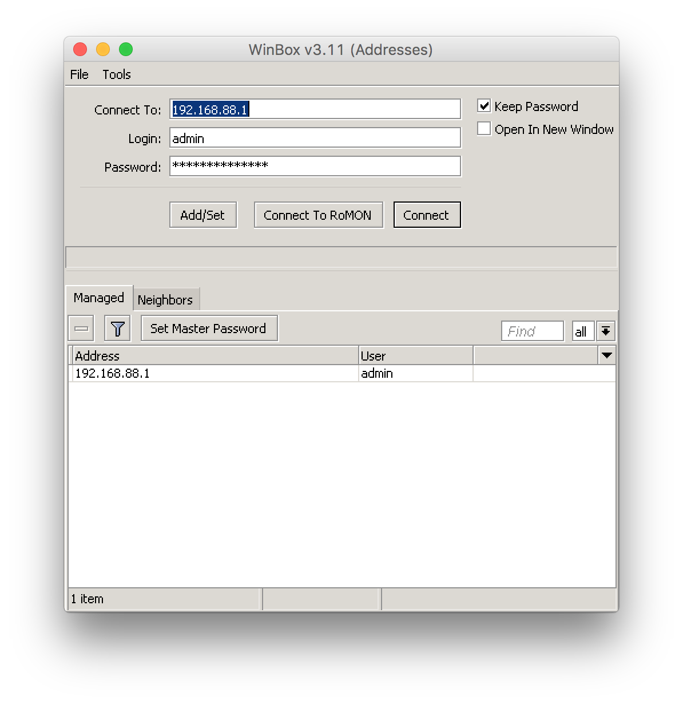

# winbox-mac

winbox-mac is [MikroTik](https://mikrotik.com) Winbox converted to macOS app using [WineBottler](http://winebottler.kronenberg.org).

Icon is from [Winbox4Mac](http://joshaven.com/resources/tools/winbox-for-mac/) used with [Joshaven Potter](http://joshaven.com/#contact) permission.

## Installation

Can be easily installed with [Homebrew Cask](https://caskroom.github.io):

```sh
brew tap nrlquaker/personal
brew cask install winbox-mac
```

## Notes

Managed addresses are saved to app folder so if you want keep them after update to newer version need to save them in the old version using `Tools -> Export...` then load in the new one `Tools -> Import...`

## Version

Current version is based on [Winbox 3.12](https://download2.mikrotik.com/routeros/winbox/3.12/winbox.exe)

## Screenshot



## License

winbox-mac is released under the [MIT License](https://github.com/nrlquaker/nfov/blob/master/LICENSE)
