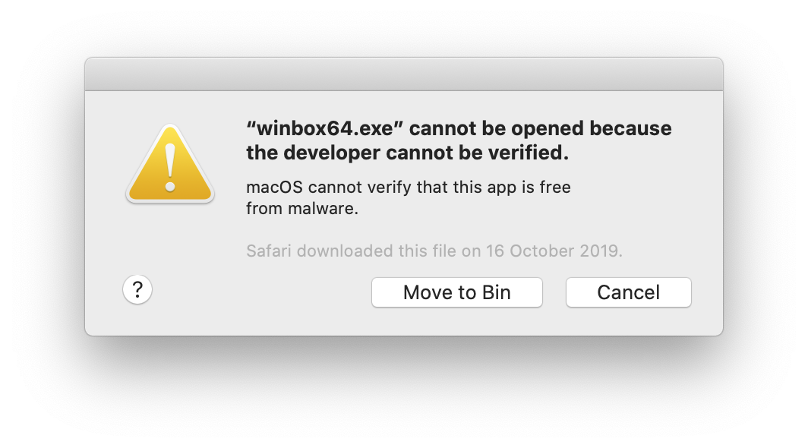
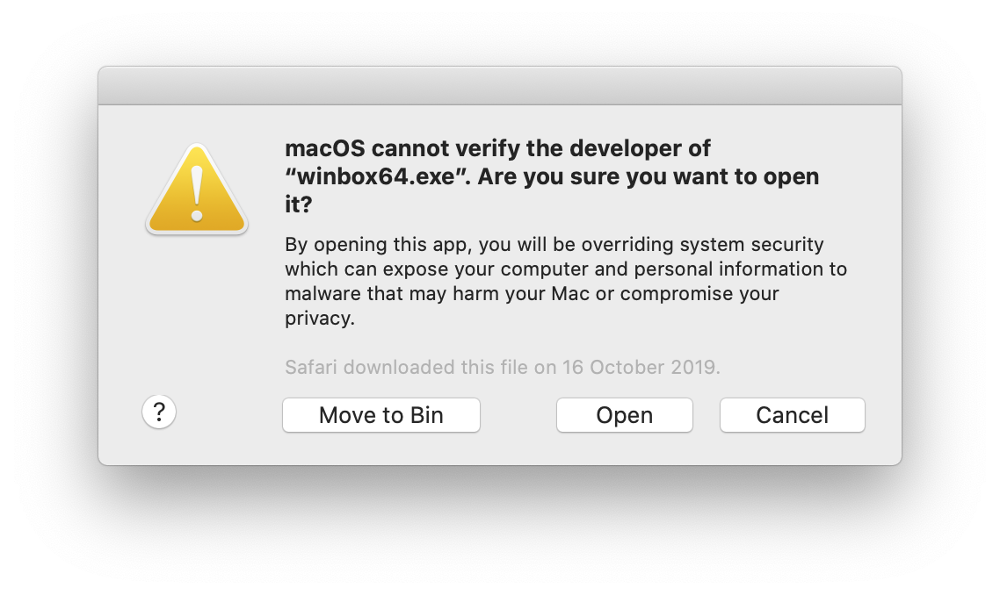

# Unverified developer warning

If you want to remove this warning

Open `System Preferences -> Security & Privacy -> General` and click `Allow anyway` near `winbox64.exe`

Next time you see warning just click `Open` to not show it again.

or just enter the following command in the terminal:

`xattr -rd com.apple.quarantine /Applications/Winbox-mac.app`
