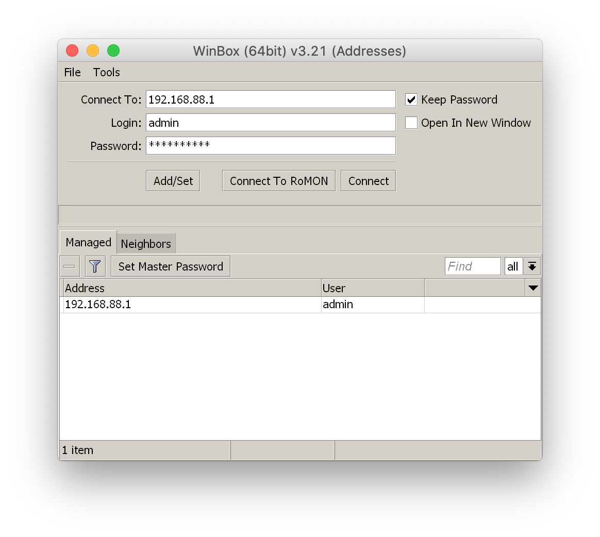

# Retina mode

To enable retina mode run:

`WINEPREFIX="~/Library/Application Support/com.mikrotik.winbox" /Applications/Winbox-mac.app/Contents/Resources/wine/bin/wine64 regedit retina.reg`

`retina.reg` is available [here](https://github.com/nrlquaker/winbox-mac/blob/master/retina_mode/retina.reg).

  

